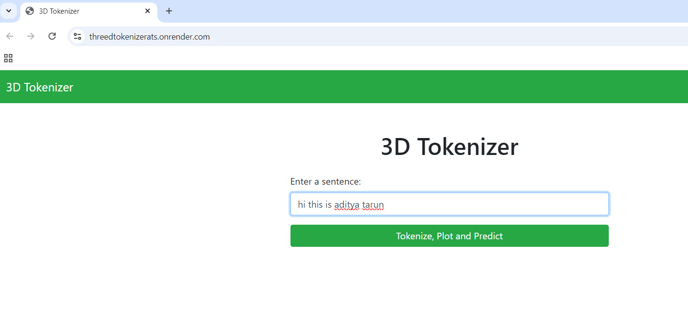
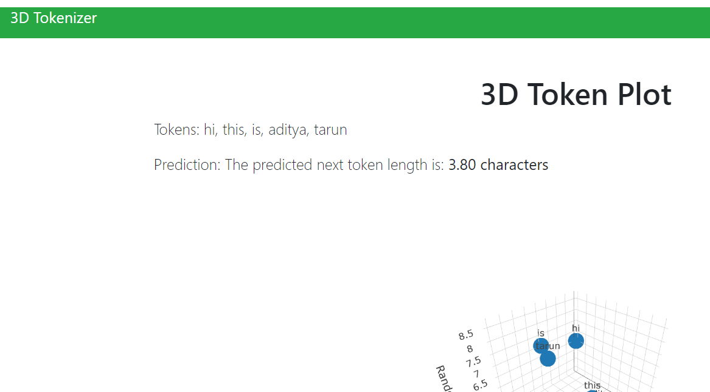
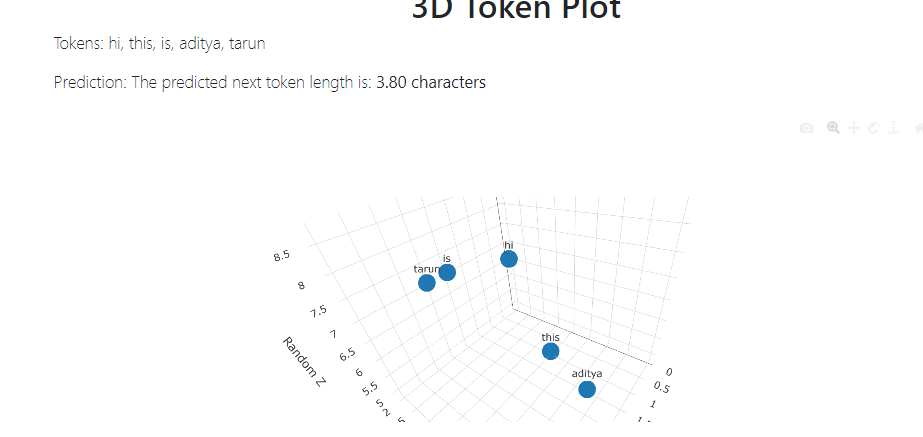

# 🧑‍💻 3D Tokenizer

Welcome to the **3D Tokenizer** project! This web application allows users to input sentences and visualize the tokenization process in a 3D scatter plot. Built with Node.js and Express for the backend and plain HTML/CSS for the frontend, this project serves as an educational tool for understanding natural language processing (NLP).

## 🌟 Features

- **Tokenization**: Enter a sentence to see how it is split into individual tokens (words).
- **3D Visualization**: View tokens in a 3D scatter plot that displays their length and a randomly generated value.
- **User-Friendly Interface**: Simple and intuitive design for easy interaction.

## 🛠️ Technologies Used

- **Backend**: Node.js, Express
- **NLP Library**: Natural
- **Frontend**: HTML, CSS, JavaScript
- **3D Visualization**: Plotly.js

## 🚀 Getting Started

### Prerequisites

- Node.js installed on your machine

### Installation

1. Clone the repository:
   ```bash
   git clone https://github.com/AdityaTarunofficial/tokenizer.git
   ```
2. Navigate to the project directory:
   ```bash
   cd tokenizer
   ```
3. Install the required dependencies:
   ```bash
   npm install
   ```
4. Start the server:
   ```bash
   node index.js
   ```
5. Open your browser and go to `http://localhost:3000` to access the application!

## 💡 How to Use

1. Enter a sentence in the input field.
2. Click the "Tokenize" button.
3. View the tokens and their visualization in 3D.

## Screenshots

### Home Page


### Prediction Page


### Plotting Page



